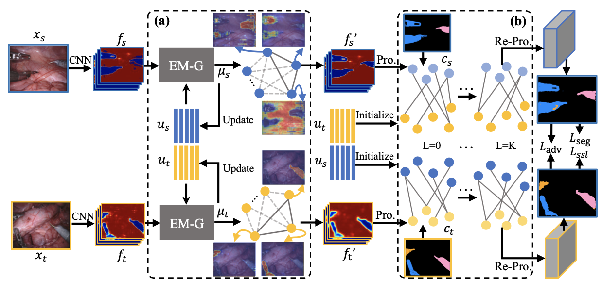

# SePIG: Prototypical Interaction Graph for Unsupervised Domain Adaptation in Surgical Instrument Segmentation
This is the official implementation of SePIG published in MICCAI'21.

## Introduction
### Abstract
Surgical instrument segmentation is fundamental for the ad- vanced computer-assisted system. The variability of the surgical scene, a major obstacle in this task, leads to the domain shift problem. Unsuper- vised domain adaptation (UDA) technique can be employed to solve this problem and adapt the model to various surgical scenarios. However, ex- isting UDA methods ignore the relationship among different categories, hindering the model learning discriminative features from a global view. Additionally, the adversarial strategy utilized in these methods only narrows down the domain gap at the end of the network, leading to the poor feature alignment. To tackle above mentioned problems, we advance a semantic-prototype interaction graph (SePIG) framework for surgical instrument type segmentation to grasp the category-level relationship and further align the feature distribution. The proposed framework consists of prototypical inner-interaction graph (PI-Graph) and prototypical cross- interaction graph (PC-Graph). In PI-Graph, EM-Grouping module is designed to generate multi-prototypes representing the semantic infor- mation adequately. Then, propagation is performed upon these multi-prototypes to communicate semantic information inner each domain. Aiming at narrowing down the domain gaps, the PC-Graph constructs hierarchical graphs upon multi-prototypes and category centers, and con- ducts dynamic reasoning to exchange the correlated information among two domains. Extensive experiments on the EndoVis Instrument Segmen- tation 2017 → 2018 scenarios demonstrate the superiority of our SePIG framework compared with state-of-the-art methods.

### Overview


### Environment
main package
- Python >= 3.7
- Pytorch >= 1.7
- numpy

### Dataset
- Source doamin: download from [Endovis17](https://endovissub2017-roboticinstrumentsegmentation.grand-challenge.org)
- Target domain: download from [Endovis18](https://endovissub2018-roboticscenesegmentation.grand-challenge.org/home/); [instrument type annotations](https://github.com/BCV-Uniandes/ISINet)
- rearrange the file as following:  
├── endovis17  
|   └── img  
|       ├── 1_frame000.png  
|       ├── 1_frame001.png  
|       └── ...  
|   └── type_lbl  
|       ├── 1_frame000.png  
|       ├── 1_frame001.png  
|       └── ...  
├── endovis18  
|   └── img  
|       ├── seq_1_frame000.png  
|       ├── seq_1_frame001.png  
|       └── ...  
|   └── type_lbl  
|       ├── seq_1_frame000.png  
|       ├── seq_1_frame001.png  
|       └── ...  


## Usage
### Pre-work
- prepare dataset and modify the `cfg.DATASET.SOURCE_DIR` and `cfg.DATASET.TARGET_DIR` in `core/config/config.py`
- download the pretrained model [BaiduNetDisk](https://pan.baidu.com/s/1-vzpy7m_QDKcao6IiSKt0Q) code: sgdo, and put it in ./pretrained_model

### Train
Step 1: generate psuedo label
```
cd core/scripts
python SSL.py --exp-suffix EXP_SUFFIX
```

Step 2: train the metacorrection framework
```
python train_adv.py --exp-suffix EXP_SUFFIX
```

### Test
```
python eval_src.py --exp-suffix EXP_SUFFIX
```


## Acknowledgment
The model code is heavily borrowed from [Pytorch-Deeplab](https://github.com/speedinghzl/Pytorch-Deeplab)
